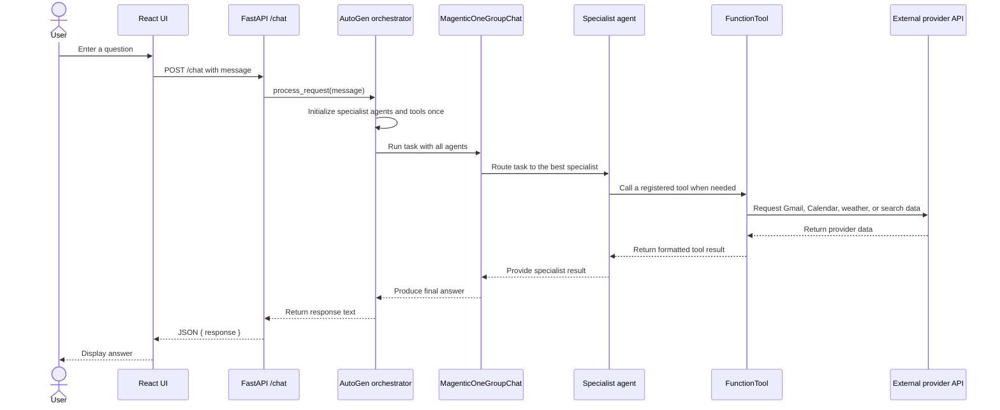

# AI Personal Assistant with Autogen

A multi-agent personal assistant system built with AutoGen AgentChat that provides email, calendar, weather, and web search capabilities through a FastAPI backend and React web interface.

## Features

- **Multi-Agent System**: Specialized agents for email, calendar, weather, and web search
- **Email Management**: Gmail integration for reading, searching, drafting, and sending emails
- **Calendar Management**: Google Calendar integration for event scheduling and management
- **Weather Information**: Real-time weather data and forecasts
- **Web Search**: Tavily-powered search for web information, news, and research
- **React Web UI**: Browser-based chat interface for asking questions and viewing responses
- **FastAPI Backend**: Modern, fast web API with automatic documentation

## Project Structure

```
personal-assistant/
├── source/
|   ├──__init__.py
│   ├── agents/                  # Agent construction and orchestration
│   │   ├── agent_factory.py
│   │   └── personal_agents.py
│   ├── clients/                 # External API clients
│   │   └── tavily_client.py
│   ├── services/                # Application and formatting logic
│   │   └── search_service.py
│   ├── tools/                   # AutoGen tool adapters for all providers
│   ├── utils/                   # Shared utilities
│   ├── config.py                # Configuration management
│   ├── prompts.py              # System prompts for all agents
│   └── __init__.py
├── app.py                      # FastAPI backend server
├── requirements.txt            # Python dependencies
├── credentials.json            # Google API credentials (you create this)
├── token.json                  # OAuth token (auto-generated)
└── logs/                       # Log files directory
```

## Setup

### 1. Create and Activate the Virtual Environment (Python 3.12)

Open PowerShell in the project root:

```powershell
cd "C:\Users\kanch\Documents\GitHub Projects\code"

# Create virtual environment
python -m venv vn_autogen
```

PowerShell may block activation scripts by default. Allow locally created scripts for your Windows user:

```powershell
Set-ExecutionPolicy -Scope CurrentUser -ExecutionPolicy RemoteSigned
```

Activate the environment:

```powershell
.\vn_autogen\Scripts\Activate.ps1
```

On macOS/Linux, use:

```bash
source vn_autogen/bin/activate
```

### 2. Install Dependencies

```powershell
python -m pip install -r requirements.txt
```

```bash
# macOS/Linux, after activating the virtual environment
python -m pip install -r requirements.txt
```

### 3. Environment Configuration

Set the required secrets in the current PowerShell session. Replace the placeholder values with newly generated keys:

```powershell
$env:OPENAI_API_KEY = "your_new_openai_api_key_here"
$env:TAVILY_SEARCH_KEY = "your_new_tavily_api_key_here"

# Optional - Customization
$env:OPENAI_MODEL = "gpt-4o-mini"
$env:OPENAI_TEMPERATURE = "1"
$env:MAX_RESULTS = "5"
$env:DEFAULT_TIMEZONE = "Asia/Kolkata"
```

These variables apply only to the current terminal session. The application reads them from `source/configurations.py`.

### 4. Google API Setup

1. Create a project in [Google Cloud Console](https://console.cloud.google.com/)
2. Enable Gmail API and Google Calendar API
3. Create credentials (OAuth 2.0 Client IDs)
4. Download the OAuth client credentials file and rename it to `credentials.json`
5. Place the file in the project root directory

### 5. Tavily API Setup

1. Sign up at [Tavily](https://tavily.com/)
2. Get your API key from the dashboard
3. Set it in the `TAVILY_SEARCH_KEY` environment variable above

### 6. Run Initial OAuth Flow

On first run, the application will open a browser window for Google OAuth authorization. This creates a `token.json` file for future authentication.

### Running the Application

The application uses a FastAPI backend and a React/Vite frontend. For local development, run them in two PowerShell terminals.

#### Terminal 1: Start the FastAPI Backend

In the project root, activate the environment and set the API keys for the current terminal:

```powershell
.\vn_autogen\Scripts\Activate.ps1

$env:OPENAI_API_KEY = "your_new_openai_api_key_here"
$env:TAVILY_SEARCH_KEY = "your_new_tavily_api_key_here"

uvicorn app:app --host 127.0.0.1 --port 8000
```

Leave this terminal running.

#### Terminal 2: Start the React Frontend

Open a second PowerShell terminal:

```powershell
cd "C:\Users\kanch\Documents\GitHub Projects\code\frontend"
npm.cmd run dev
```

Open `http://127.0.0.1:5173/` in your browser. Vite forwards `/chat` requests to the FastAPI server on port `8000`.

### Serving the Built UI from FastAPI

To serve the compiled React UI directly from FastAPI, build the frontend first:

```powershell
cd "C:\Users\kanch\Documents\GitHub Projects\code\frontend"
npm.cmd run build
```

Then start the backend from the project root:

```powershell
cd "C:\Users\kanch\Documents\GitHub Projects\code"
.\vn_autogen\Scripts\Activate.ps1

$env:OPENAI_API_KEY = "your_new_openai_api_key_here"
$env:TAVILY_SEARCH_KEY = "your_new_tavily_api_key_here"

uvicorn app:app --host 127.0.0.1 --port 8000
```

Open `http://127.0.0.1:8000/` in your browser. Rebuild the frontend after frontend code changes so the latest JavaScript and CSS files are available to FastAPI.

### API Endpoints

- **POST /chat**: Send a direct assistant request. Example body: `{"message": "What is the weather in Delhi?"}`

## Application Architecture

The application has two processes during local development: the React/Vite frontend on port `5173` and the FastAPI backend on port `8000`. Vite proxies `/chat` requests to FastAPI, so the browser does not call the OpenAI or provider APIs directly.

```mermaid
flowchart TD
   User[User]
   UI[React + TypeScript UI<br/>Vite :5173]
   Proxy[Vite dev proxy]
   API[FastAPI app<br/>app.py :8000]
   Orchestrator[PersonalAssistantOrchestrator]
   Model[OpenAIChatCompletionClient]
   Team[MagenticOneGroupChat]

   User --> UI
   UI -->|POST /chat<br/>{ message }| Proxy
   Proxy --> API
   API --> Orchestrator
   Orchestrator --> Model
   Orchestrator --> Team

   subgraph Agents[AutoGen specialist agents]
      Email[EmailAssistant]
      Calendar[CalendarAssistant]
      Weather[WeatherAssistant]
      Search[SearchAssistant]
   end

   subgraph Tools[Registered FunctionTools]
      GmailTools[Gmail tools]
      CalendarTools[Calendar tools]
      WeatherTools[Weather tools]
      SearchTools[Search tools]
   end

   subgraph Providers[External provider APIs]
      Gmail[Google Gmail API]
      GoogleCalendar[Google Calendar API]
      Geo[Nominatim geocoding]
      OpenMeteo[Open-Meteo weather API]
      Tavily[Tavily Search API]
   end

   Team --> Email
   Team --> Calendar
   Team --> Weather
   Team --> Search
   Email --> GmailTools --> Gmail
   Calendar --> CalendarTools --> GoogleCalendar
   Weather --> WeatherTools
   WeatherTools --> Geo
   WeatherTools --> OpenMeteo
   Search --> SearchTools --> Tavily

   Team -->|final answer| API
   API -->|JSON response| UI
```

### Request Flow



### AutoGen Agent and Tool Roles

- **`OpenAIChatCompletionClient`** provides the language model used by the orchestrator and agents.
- **`MagenticOneGroupChat`** coordinates the specialist agents and decides which agent should handle the request.
- **`AssistantAgent`** represents each specialist: email, calendar, weather, and search.
- **`FunctionTool`** exposes normal Python methods to AutoGen as callable tools with schemas.
- **Tool classes** perform the actual external API calls and return formatted results to the agent.
- **FastAPI** returns only the final response to the frontend; intermediate agent messages are logged by the backend.

## Agent Capabilities

### Email Agent
- Search emails by sender, subject, or content
- Read specific emails and threads
- Draft and send new emails
- Manage email organization
- Time-aware operations with current datetime

### Calendar Agent
- Create, update, and delete events with Meet integration
- Schedule recurring meetings
- Find free time slots
- Respond to meeting invitations
- Bulk event creation
- Time-aware scheduling with current datetime

### Weather Agent
- Current weather conditions for any location
- Weather forecasts (hourly/daily/tomorrow)
- Rain probability predictions
- Location geocoding


### Search Agent
-  General web search with Tavily
- Comprehensive research with detailed analysis
-  Uses current datetime for temporal queries

## Configuration

All configuration is managed through the `configurations.py` file. Key settings include:

- **OpenAI Configuration**: API key, model selection, temperature
- **Tavily Configuration**: Search API key and result limits
- **Google API Configuration**: Credentials file paths
- **Timezone Configuration**: Default timezone for all operations

## Development

### Adding New Tools

1. Create tool methods in the relevant class (e.g., `SearchTools`)
2. Add tools to the `as_function_tools()` method
3. Update the agent's system prompt in `prompts.py`

### Adding New Agents

1. Create the agent in `personal_agents.py`
2. Add agent to the orchestrator's agent list
3. Create corresponding tools and prompts

### Testing Individual Components

Run Python modules without adding `.py` to the module name:

```powershell
# Test search tools
python -m source.tools.search_tools

# Test weather tools
python -m source.tools.weather_tools

# Test calendar tools
python -m source.tools.calendar_tools

# Test full orchestrator
python -m source.agents.personal_agents
```

The standalone weather test is currently disabled in `source/tools/weather_tools.py`. Uncomment its `if __name__ == "__main__":` block before running that module as a test. The orchestrator test requires valid API keys and may also trigger Google OAuth for Gmail and Calendar access.

## Logging

All operations are logged to:
- Console output for real-time monitoring
- `logs/personal_assistant.log` for persistent logging
- Structured logging with timestamps and log levels

## Troubleshooting

### Common Issues

1. **Virtual Environment Issues**:
   ```bash
   # Ensure virtual environment is activated
   which python  # Should point to your venv
   ```

2. **Google OAuth Issues**: 
   - Ensure `credentials.json` is properly configured
   - Check Google Cloud Console API quotas
   - Verify OAuth consent screen is configured

3. **Tavily API Errors**:
   - Verify API key is correct
   - Check rate limits and usage quotas
   - Ensure proper internet connectivity

4. **OpenAI API Errors**: 
   - Verify API key and check rate limits
   - Monitor token usage for large requests
   - Check model availability

5. **Import Errors**: 
   - Ensure virtual environment is activated
   - Install all dependencies: `pip install -r requirements.txt`
   - Check Python version compatibility

